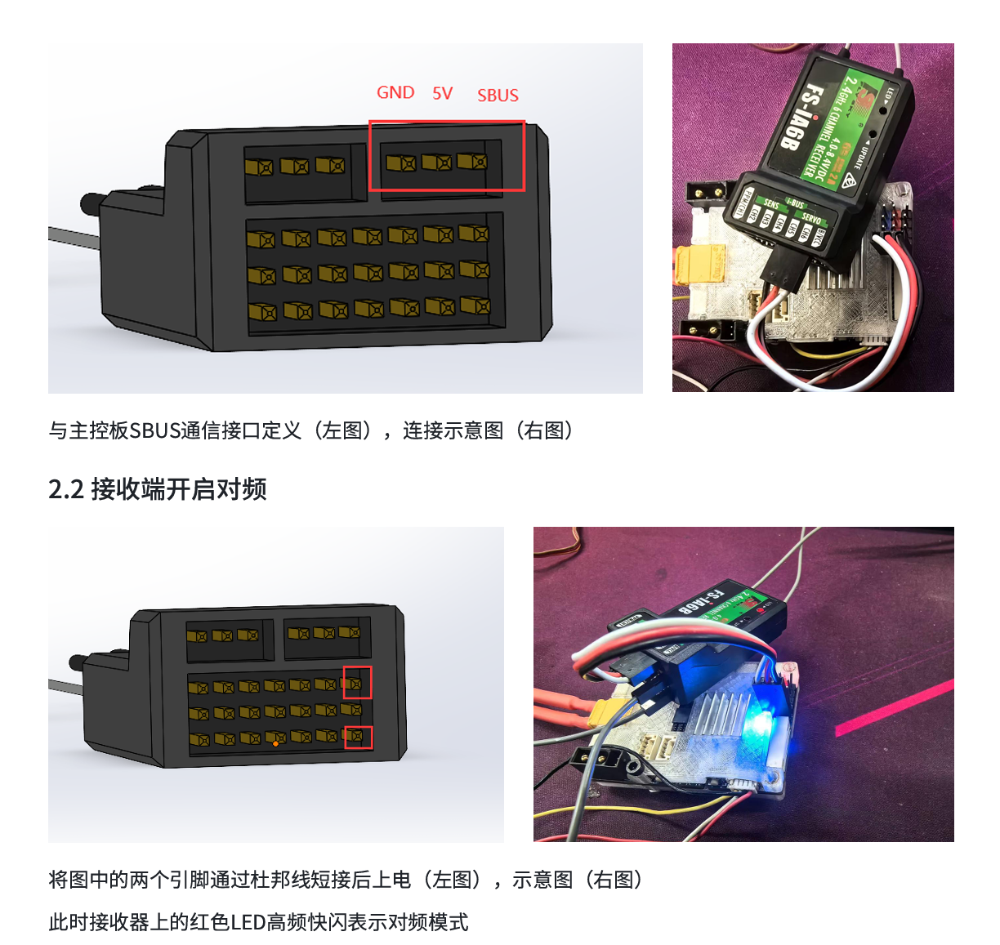
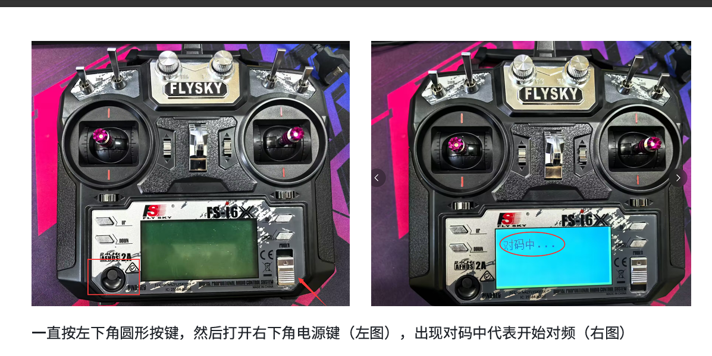

# FS-i6X / iA6B SBUS 接入说明

author:klsdn
data:2026.5.25
version:1.0

本项目使用 FS-i6X 遥控器搭配 iA6B 接收机，接收机输出 SBUS，STM32H723 通过 UART5 + DMA 接收。代码保留独立的 `I6X` 类，负责 SBUS 帧接收、通道解包、拨杆状态转换、在线判断，以及底盘/云台命令映射。

## 当前硬件与串口配置

- 配置方式：和步兵内的uart5基本一致除了DMA Setting 的配置为 Circular 而非Normal 该项应该可以更改 后续研究不同

- 接收机输出：SBUS。
- UART：`UART5`。
- 波特率：`100000`。
- 数据格式：`8E2`，在 STM32 HAL 中对应 `UART_WORDLENGTH_9B + UART_PARITY_EVEN + UART_STOPBITS_2`。
- SBUS 帧长：`25` 字节。
- 帧头：`0x0F`。
- 帧尾：`0x00`。
- 接收方式：`HAL_UART_Receive_DMA()` 固定 25 字节接收，完成后进入 `HAL_UART_RxCpltCallback()`。

## 接线与对频示意





## 接入方式

初始化：

```cpp
i6x.init(I6X_UART, nullptr, I6X_RX_BUFFER_SIZE);
```

主循环在线判断：

```cpp
i6x.update_online(HAL_GetTick());
```

UART DMA 接收完成回调：

```cpp
extern "C" void HAL_UART_RxCpltCallback(UART_HandleTypeDef *huart)
{
    if (huart->Instance == UART_I6X)
    {
        HAL_GPIO_TogglePin(GPIOC, GPIO_PIN_15);
        i6x.unpack(HAL_GetTick());
        i6x_start_dma_receive(I6X_UART, i6x.Rx_Buffer, i6x.Rx_Buffer_Size);
    }
}
```

## 通道与拨杆约定

解包后的摇杆通道统一映射到 `-660 ~ 660`。`SWC` 是三档拨杆，会产生上 / 中 / 下三态；`SWA`、`SWB`、`SWD` 是两档拨杆，只会产生上 / 下两态，不会产生中位。

```cpp
SWC:             上 = 1, 中 = 0, 下 = -1
SWA / SWB / SWD: 上 = 1, 下 = 0
```

当前工程的通道分配：

| SBUS 通道 | 项目含义 | 对应宏 |
| --- | --- | --- |
| `ch[0]` | 云台 `yaw` | `I6X_GIMBAL_YAW_CH` |
| `ch[1]` | 云台 `pitch` | `I6X_GIMBAL_PITCH_CH` |
| `ch[2]` | 底盘 `y / vy` | `I6X_CHASSIS_VY_CH` |
| `ch[3]` | 底盘 `x / vx` | `I6X_CHASSIS_VX_CH` |
| `ch[4]` | 预留 | - |
| `ch[5]` | 预留 | - |

当前工程的拨杆分配：

| 拨杆 | 数组下标 | 项目含义 |
| --- | --- | --- |
| `SWA` | `s[0]` | 预留，两档：上 `1` / 下 `0` |
| `SWB` | `s[1]` | 预留，两档：上 `1` / 下 `0` |
| `SWC` | `s[2]` | 底盘模式，上 / 中 / 下三段 |
| `SWD` | `s[3]` | 预留，两档：上 `1` / 下 `0` |

`SWC` 三段模式：

| SWC 位置 | `chassis_cmd.mode` | `gimbal_cmd.mode` | 含义 |
| --- | --- | --- | --- |
| 上 | `I6X_CHASSIS_ZERO_FORCE` | `I6X_GIMBAL_ZERO_FORCE` | 安全/无力模式，命令清零 |
| 中 | `I6X_CHASSIS_FREE` | `I6X_GIMBAL_FREE` | 自由运动/云台编码器模式 |
| 下 | `I6X_CHASSIS_TOP` | `I6X_GIMBAL_TOP` | 小陀螺/云台自稳模式 |

## 命令映射层

业务代码不建议直接到处使用 `rc.ch[]` 或 `rc.s[]` 下标。优先读取 `i6x.chassis_cmd` 和 `i6x.gimbal_cmd`：

```cpp
i6x.update_online(HAL_GetTick());

if (i6x.chassis_cmd.enable)
{
    vx_set = i6x.chassis_cmd.vx;
    vy_set = i6x.chassis_cmd.vy;
}
else
{
    vx_set = 0.0f;
    vy_set = 0.0f;
}

if (i6x.gimbal_cmd.enable)
{
    yaw_speed_set = i6x.gimbal_cmd.yaw_speed;
    pitch_speed_set = i6x.gimbal_cmd.pitch_speed;
}
else
{
    yaw_speed_set = 0.0f;
    pitch_speed_set = 0.0f;
}
```

云台 yaw/pitch 速度直接由归一化通道值乘以最大速度得到，当前不再额外叠加摇杆方向宏：

```cpp
gimbal_cmd.yaw_speed = i6x_norm_ch(yaw_channel) * I6X_GIMBAL_MAX_YAW_SPEED;
gimbal_cmd.pitch_speed = i6x_norm_ch(pitch_channel) * I6X_GIMBAL_MAX_PITCH_SPEED;
```

当接收机离线、failsafe 触发，或 `SWC` 位于上档安全位时，底盘和云台命令都会清零。

## DMA Buffer 放置规则(我遇到的纯vscode内生成问题 好像为编译器指向问题 如为其他编译器可不考虑 遇到dma数据无法访问的时候可参考此方式)

STM32H7 的 DTCM 位于 `0x20000000`，CPU 访问很快，但 DMA1/DMA2 无法访问。普通全局变量、类成员数组、`.bss` 如果放进 DTCM，会导致 UART DMA 接收失败。

本项目采用的规则：

- 普通数据仍然保留在 DTCM。
- 只有 DMA buffer 单独放到 `.dma_buffer` 段。
- `.dma_buffer` 在链接脚本中放到 `RAM_D2`。
- DMA buffer 使用 32 字节对齐，方便以后开启 D-Cache。

代码模板：

```cpp
static uint8_t i6x_rx_dma_buffer[I6X_RX_BUFFER_SIZE]
    __attribute__((section(".dma_buffer"), aligned(32)));
```

链接脚本模板：

```ld
.dma_buffer (NOLOAD) :
{
  . = ALIGN(32);
  *(.dma_buffer)
  *(.dma_buffer*)
  . = ALIGN(32);
} >RAM_D2
```

判断原则：

- `0x20000000` 开头：通常是 DTCM，不适合 DMA buffer。
- `0x30000000` 开头：通常是 RAM_D2，适合 DMA buffer。

## 日后改进

- 融入项目后可减少大量函数
- 通讯层带待融入整体项目
- 后续考虑dma双通道和精简...
